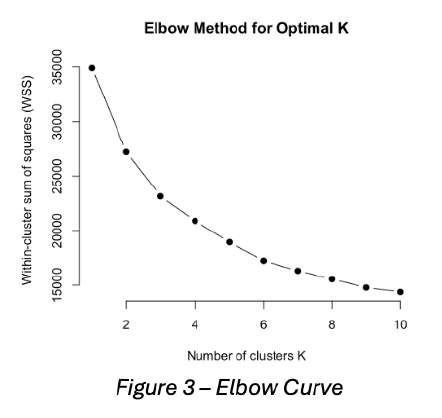

# Machine Learning

This project explores **three core machine learning tasks** — Unsupervised Learning, Regression, and Classification — using real-world datasets from Kaggle.  
The goal was to **apply appropriate ML techniques**, analyze results, and provide actionable insights where appropriate.

---

## Project Overview

As part of this project, I completed three distinct tasks:

1. **Unsupervised Learning**  
   - **Goal:** Identify homogeneous population groups and/or perform dimension reduction.  
   - **Technique:** Clustering (K-means).
2. **Regression**  
   - **Goal:** Predict a continuous target variable using regression models.  
   - **Techniques:** Linear, Ridge & Lasso Regression.
3. **Classification**  
   - **Goal:** Classify observations into categories based on predictor variables.  
   - **Techniques:** K-Nearest Neighbors (KNN), Support Vector Machine (SVM).

---

## Datasets

- **Dataset 1 (Tasks 1 & 3):** [Link to Kaggle](#)  
  - Size: X rows × Y columns  
  - Key features: [briefly describe key variables]  

- **Dataset 2 (Task 2):** [Link to Kaggle](#)  
  - Size: X rows × Y columns  
  - Key features: [briefly describe key variables]  

---

# Results and Findings

## 1. Unsupervised Learning — Clustering

With the primary objective of **identifying homogeneous subgroups** within the dataset using an unsupervised learning approach, **K-Means clustering** was employed to group individuals based on shared characteristics such as lifestyle factors, demographics, and health information. 

This process aimed to **uncover patterns and hidden structures** in the data without relying on predefined labels.

**Outlier Handling:**
- During the initial dataset exploration, some entries were observed to have BMI values in an unrealistic range. While a BMI of 60 is plausible (severe obesity), values greater than 60 are extremely rare and likely due to data entry errors.
- Because K-Means is **sensitive to outliers**, these individuals were removed from the analysis.

This preprocessing step was essential to maintain clustering robustness and ensure more meaningful population segmentation.

**Findings**

- **Diabetes Distribution:**
   - A majority of individuals (>80%) fell under the No Diabetes category.
   - Prediabetes represented <5%, while Diabetes accounted for around 10% of the population.
- **Binary Variable Distribution:**
   - The presence of high blood pressure was more prevalent among individuals with diabetes and prediabetes compared to those without diabetes.
   
  

*Bar charts illustrating the distribution of diabetes across variables*

- **Optimal Clusters:**
   - The Elbow Curve indicated that K = 3 provided an optimal balance between complexity and explanatory power.

  

*Elbow method for determining the optimal number of clusters.*

- **Cluster Profiles:**
   - Cluster 1: Highest average BMI with lower Education and Income — representing older individuals with poorer health.
   - Cluster 2: Slightly lower BMI with moderate Age, Education, and Income — moderate health and socioeconomic status.
   - Cluster 3: Healthiest cluster with the lowest BMI, highest Education and Income — representing younger, well-educated individuals with minimal health concerns.

  

*Summary of K-Means clustering results, displaying cluster sizes and key feature averages (BMI, Age, Education, Income).*

- **Visual Patterns:**
   - The box plot of average BMI showed a decreasing trend across clusters, consistent with cluster health segmentation.
   - The bar plot of general health (GenHlth) distribution revealed a higher proportion of good health in clusters with lower BMI and higher socioeconomic status.
   
  

*Health distributions across clusters*

**Strategic Recommendations**
Based on the clustering insights, tailored health campaigns are recommended for each subgroup:
- **Cluster 1 (Priority Group)**
   - Individuals in this group exhibit poorest health indicators (highest BMI, worst mental and general health).
   - **Action:** Implement targeted health campaigns focusing on improving lifestyle habits (dietary guidance, physical activity programs) and increasing access to preventive healthcare at subsidized rates.
   - **Rationale:** Lower income levels in this group indicate that cost-effective and accessible interventions will have the most impact.
- **Cluster 2 & 3 (Maintenance Group)**
   - These clusters show better overall health and higher education/income levels.
   - **Action:** Encourage routine health checkups, stress management programs, and disease prevention initiatives to maintain or improve current health levels.
    
By tailoring interventions to each cluster’s unique profile, health campaigns can be more impactful and resource-efficient, ultimately improving population health outcomes.

---

## 2. Regression Analysis

The goal of this task was to predict the Premium Amounts of insurance policies using various predictor variables. 

Using machine learning models, insurance companies can personalize insurance plans, while customers can make well-informed decisions regarding their coverage.

**Models Used:**
Three regression models were implemented to compare traditional and regularized approaches:
- **Linear Regression:** Basic regression model predicting a continuous outcome as a linear combination of features.
- **Ridge Regression:** Incorporates an L2 penalty, shrinking coefficients to prevent overfitting.
- **Lasso Regression:** Incorporates an L1 penalty, which can drive coefficients to zero, effectively performing feature selection.

**Data Preprocessing:**
- **Missing Values:** Removed where necessary.
- **Categorical Variables:** Converted into dummy variables via one-hot encoding for model compatibility.
- **Scaling:** Continuous features were scaled to ensure fair weighting across features.
- **Train-Test Split:** Data was split into 70:30 for training and testing to evaluate performance on unseen data and prevent overfitting.

**Findings**
To evaluate model performance, two metrics were used:
- **Root Mean Squared Error (RMSE):** Measures the model's prediction error (lower is better).
- **R² (Coefficient of Determination):** Measures how well the model explains the variance in the data (higher is better).

  

*Mathematical formulas used to calculate RMSE and R² for model evaluation.*

  

*Performance comaprison of each regression model*

- **Key Insights:**
   - The comparison above clearly shows that **Lasso Regression outperforms** both Linear and Ridge regression models in terms of prediction accuracy (RMSE) and explanatory power (R²).
   - This suggests that incorporating **L1 regularization** enhances the model’s ability to generalize and focus on key influencing variables when predicting Premium Amounts.

---

## 3. Classification Analysis

This task is focused on **predicting customer conversion** (binary: 0 = No Conversion, 1 = Converted) using demographic, insurance, and discount-related features.

This enables businesses to focus on high-potential prospects and optimize marketing strategies.

**Models Used**
- **K-Nearest Neighbors (KNN):**
   - Non-parametric algorithm using the majority class of closest neighbors.
   - Suitable for non-linear decision boundaries.
   - K = 5 chosen to balance bias and variance.
- **Support Vector Machine (SVM):**
   - Constructs an optimal hyperplane that maximizes class separation.
   - RBF Kernel used to capture non-linear relationships.

**Data Preparation**
- **Target variable:** Converted Conversion_Status into a factor for compatibility with classification algorithms.
- **Categorical variables:** Transformed into numeric via dummy encoding.
- **Class imbalance:** Detected underrepresentation of Conversion_Status = 0. Applied class weights during training to ensure fair learning.
- **Feature scaling:** Standardized numerical variables to mean = 0 and variance = 1 (important for distance-based KNN).
- **Train-test split:** 70% training / 30% testing to evaluate performance on unseen data.

  

*Model Performance Metrics for KNN and SVM*

**Model Interpretation:**
- **KNN:**
   - Achieved high accuracy (83.76%), correctly predicting the majority of cases.
   - Specificity (91.39%) indicates strong ability to correctly detect the majority class (non-converted customers).
   - Positive Predictive Value (86.20%) shows reliability when predicting the minority class (converted customers).
- **SVM:**
   - Lower accuracy (53.18%), with weaker predictive power overall.
   - Sensitivity (37.90%) and specificity (64.39%) were low, meaning poorer ability to correctly identify both converted and non-converted customers.
 
**ROC Curve Analysis**
- To further evaluate the performance of the classification models, **Receiver Operating Characteristic (ROC)** curves were plotted for both KNN and SVM models.
- The ROC curve illustrates the **trade-off** between the True Positive Rate (Sensitivity) and False Positive Rate (1 - Specificity) across different classification thresholds.

  

*The ROC analysis supports previous findings, indicating that the KNN model outperforms SVM in effectively predicting customer conversion.*
  
**Key Insight:**
- Contrary to typical expectations, **KNN outperformed SVM** in this dataset. The distance-based KNN model, with appropriate feature scaling and K = 5, provided a better balance between accuracy and predictive reliability.
- The SVM with RBF kernel **struggled to separate the classes**, possibly due to class imbalance and the feature space characteristics.

